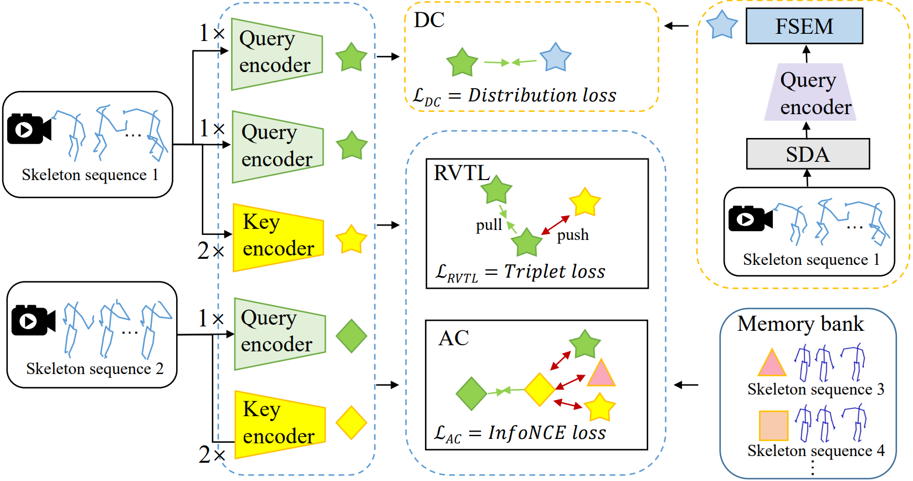

# RVTCLR

PyTorch implementation of "Modeling the Relative Visual Tempo for Self-supervised Skeleton-based Action Recognition", ICCV 2023
[[PDF](https://openaccess.thecvf.com/content/ICCV2023/papers/Zhu_Modeling_the_Relative_Visual_Tempo_for_Self-supervised_Skeleton-based_Action_Recognition_ICCV_2023_paper.pdf)]



## Data Preparation
- We use NTU RGB+D and NTU RGB+D 120 as our datasets.
```
# generate raw database for NTU-RGB+D
python tools/ntu_gendata.py --data_path <path to nturgbd+d_skeletons>

# preprocess the above data for our method
python feeder/preprocess_ntu.py
```

## Unsupervised Pretraining
- Example for unsupervised pretraining of RVTCLR. You can change .yaml files in config/ntu60/pretext folder.
```
# train on NTU RGB+D xsub joint stream
python main.py pretrain_skeletonclr --config config/ntu60/pretext/pretext_skeletonclr.yaml

# train on NTU RGB+D xsub bone stream
python main.py pretrain_skeletonclr --config config/ntu60/pretext/pretext_skeletonclr_bone.yaml

# train on NTU RGB+D xsub motion stream
python main.py pretrain_skeletonclr --config config/ntu60/pretext/pretext_skeletonclr_motion.yaml
```

## Linear Evaluation
- Example for linear evaluation of RVTCLR. You can change .yaml files in config/ntu60/linear_eval folder.
```
# Linear_eval on NTU RGB+D xsub joint stream
python main.py linear_evaluation --config config/ntu60/linear_eval/linear_eval_skeleton.yaml

# Linear_eval on NTU RGB+D xsub bone stream
python main.py linear_evaluation --config config/ntu60/linear_eval/linear_eval_skeleton_bone.yaml

# Linear_eval on NTU RGB+D xsub motion stream
python main.py linear_evaluation --config config/ntu60/linear_eval/linear_eval_skeleton_motion.yaml
```

## Acknowledgement
This repo is based on 
  - [CrosSCLR](https://github.com/LinguoLi/CrosSCLR)
  - [AimCLR](https://github.com/Levigty/AimCLR)
  - [AS-CAL](https://github.com/LZU-SIAT/AS-CAL)

## Citation
